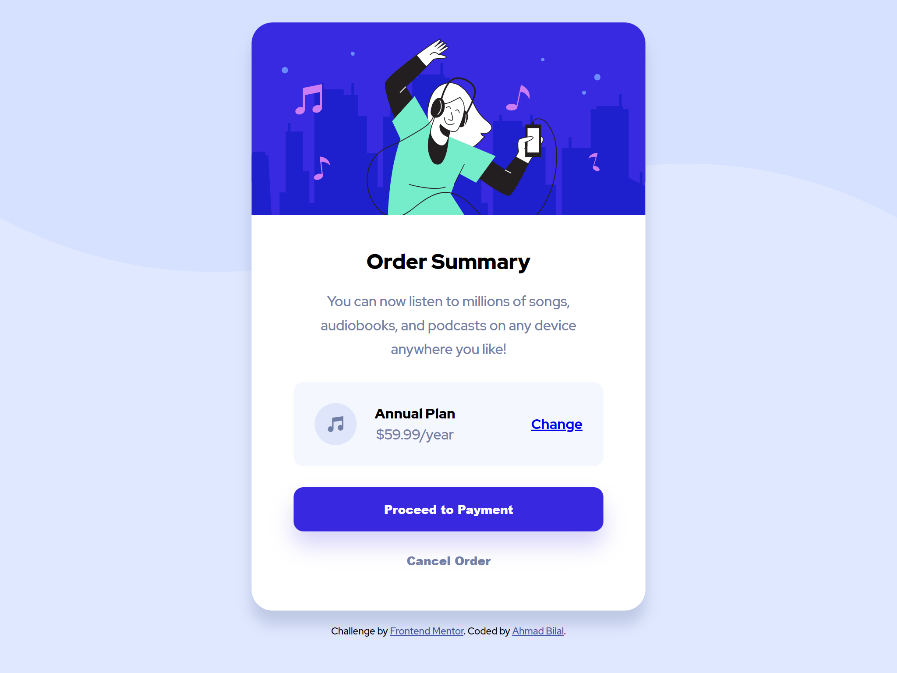

# Frontend Mentor - Order summary card solution

This is a solution to the [Order summary card challenge on Frontend Mentor](https://www.frontendmentor.io/challenges/order-summary-component-QlPmajDUj). Frontend Mentor challenges help you improve your coding skills by building realistic projects. 

## Table of contents

- [Overview](#overview)
  - [The challenge](#the-challenge)
  - [Screenshot](#screenshot)
  - [Links](#links)
- [My process](#my-process)
  - [Built with](#built-with)
  - [Useful resources](#useful-resources)
- [Author](#author)

## Overview

### The challenge

Users should be able to:

- See hover states for interactive elements

### Screenshot

### Links

- [Solution Page](https://www.frontendmentor.io/solutions/order-summary-component-using-bem-CpjvXHcq3)
- [View Live Site](https://ahmadbilalse.github.io/order-summary-component/)

## My process

### Built with

- HTML5 markup
- CSS custom properties using BEM
- Desktop-first workflow

### Useful resources

- [Get BEM](http://getbem.com/) - This helped me learn about BEM.
- [BEM Grandchildren: How To Handle Deeply Nested Elements](https://scalablecss.com/bem-nesting-grandchild-elements/) - This helped me learn on how to handle deeply nested elements in BEM.

## Author

- Frontend Mentor - [@ahmadbilalse](https://www.frontendmentor.io/profile/ahmadbilalse)